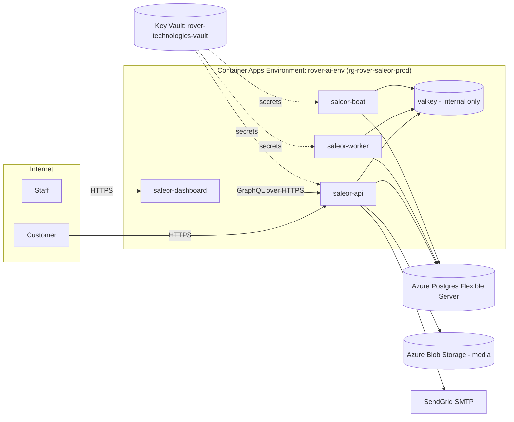

# Saleor Production Deployment (Azure Container Apps)

This document describes the production deployment of Saleor for Rover Shop, separate from the
local development setup described in the main [README.md](./README.md) (which remains
docker-compose based and is for local development only).

## Architecture



- **saleor-api** — Saleor GraphQL API (`ghcr.io/saleor/saleor`), external ingress, custom domain `api.rovershop.io`
- **saleor-dashboard** — Saleor Dashboard (`ghcr.io/saleor/saleor-dashboard`), external ingress, custom domain `admin.rovershop.io`
- **saleor-worker** — Celery worker (no `-B`), no ingress
- **saleor-beat** — Celery beat scheduler, fixed at exactly 1 replica (no ingress). Kept separate from
  the worker so that scaling the worker never causes scheduled tasks to fire more than once.
- **valkey** — Redis-compatible cache/broker, internal-only ingress, single replica
- **saleor-migrate** / **saleor-createsuperuser** — Container Apps Jobs (manual trigger) used for
  one-off database operations, since Saleor does not auto-migrate on container start

Postgres is an Azure Database for PostgreSQL Flexible Server (Burstable `Standard_B2s`), not a
container. It's reachable over the public endpoint with a firewall rule allowing Azure-internal
traffic (Container Apps Environment doesn't have a fixed outbound IP without a NAT gateway/VNet
integration). Media uploads go to Azure Blob Storage via Saleor's native `AzureMediaStorage` backend
(no custom image needed). Email is sent via SendGrid SMTP. Jaeger and Mailpit from the local
docker-compose stack are dev-only and are not part of this deployment.

> **Postgres extensions**: Azure Postgres Flexible Server requires extensions to be explicitly
> allow-listed before Django migrations can `CREATE EXTENSION`. This is configured via the
> `azure.extensions` server parameter (dynamic, no restart required):
> ```powershell
> az postgres flexible-server parameter set --resource-group rg-rover-saleor-prod `
>   --server-name psql-rover-saleor-prod-04 --name azure.extensions `
>   --value "hstore,pg_trgm,unaccent,btree_gin,btree_gist,citext,pgcrypto,uuid-ossp"
> ```

> **`DEBUG=False` in production**: Saleor enforces two additional required settings whenever
> `DEBUG=False`, both of which will crash the container at startup (`ImproperlyConfigured`) if
> missing: `ALLOWED_CLIENT_HOSTS` (used by Saleor's outbound HTTP client SSRF/IP-filter
> protection) and `RSA_PRIVATE_KEY` (used for JWT signing; without a fixed key, tokens wouldn't
> survive a restart or be valid across multiple replicas). Both are set in `containerApps.bicep`.

> Supabase was evaluated first but abandoned: Supabase's direct DB host is IPv6-only (no A record),
> and Azure Container Apps has no IPv6 egress, so it could not be reached at all without extra
> networking. Azure Postgres Flexible Server avoids this entirely since it's native to Azure.

## Resource inventory

| Resource | Name | Notes |
|---|---|---|
| Resource group | `rg-rover-saleor-prod` | East US 2 |
| Container Apps environment | `rover-ai-env` | |
| Log Analytics workspace | `log-rover-saleor-prod` | Container Apps logs |
| Storage account | `strovershopmediaprod` | `media` blob container, public blob read |
| Postgres Flexible Server | `psql-rover-saleor-prod-04` | Burstable `Standard_B2s`, PostgreSQL 15, database `saleor` |
| Managed identity | `id-rover-saleor-prod` | Used by api/worker/beat/jobs to read Key Vault secrets |
| Key Vault | `rover-technologies-vault` (existing, `rover-technologies-rg`) | Shared vault; Saleor secrets are prefixed `saleor-` |
| Container Apps | `saleor-api`, `saleor-worker`, `saleor-beat`, `saleor-dashboard`, `valkey` | |
| Container Apps Jobs | `saleor-migrate`, `saleor-createsuperuser` | Manual trigger only |

## Key Vault secrets

All Saleor secrets are prefixed `saleor-` to distinguish them from other projects sharing this vault
(Strapi, RoverChat, RoverFlow, etc.):

| Secret name | Purpose | Source |
|---|---|---|
| `saleor-database-url` | Azure Postgres connection string (`sslmode=require`) | Written directly by Bicep (`modules/keyVaultSecret.bicep`) from the generated admin password; never typed in manually |
| `saleor-secret-key` | Django `SECRET_KEY` | Generated |
| `rovershop-sendgrid-connection-string` | SendGrid SMTP URL for `EMAIL_URL` | SendGrid API key |
| `saleor-storage-account-key` | Azure Storage account key for media | Azure |
| `saleor-admin-email` | Bootstrap superuser email | Generated (`admin@rovershop.io`, change as needed) |
| `saleor-admin-password` | Bootstrap superuser password | Generated |
| `saleor-rsa-private-key` | RSA private key for JWT signing (`RSA_PRIVATE_KEY`); required whenever `DEBUG=False` | Generated (2048-bit, PEM, no passphrase) |

> Note: the SendGrid secret uses the `rovershop-` prefix instead of `saleor-` because it was added
> directly to the shared vault by the account owner under that existing naming convention.
> `saleor-database-url` is composed and written entirely by the `main.bicep` deployment (the
> Postgres admin password is passed as a secure deployment parameter, generated fresh each
> deployment run and never committed to a file or shown in chat).

## Environment variable mapping (compose -> production)

| docker-compose (backend.env/common.env) | Production value |
|---|---|
| `DATABASE_URL` | Azure Postgres connection string (Key Vault, written by Bicep) |
| `CACHE_URL` | `redis://valkey:6379/0` (internal Container Apps DNS) |
| `CELERY_BROKER_URL` | `redis://valkey:6379/1` |
| `EMAIL_URL` | SendGrid SMTP URL (Key Vault) |
| `SECRET_KEY` | Generated, stored in Key Vault |
| n/a | `DEBUG=False` (required for production; see note below) |
| n/a | `RSA_PRIVATE_KEY` (Key Vault `saleor-rsa-private-key`; required when `DEBUG=False`) |
| n/a | `ALLOWED_CLIENT_HOSTS` (required when `DEBUG=False`; set to same value as `ALLOWED_HOSTS`) |
| `ALLOWED_HOSTS` | `api.rovershop.io,saleor-api.<env-default-domain>` (the container app's own default FQDN is also allow-listed so the API can be smoke-tested directly, independent of custom domain/DNS status) |
| n/a | `PUBLIC_URL=https://api.rovershop.io` |
| `DASHBOARD_URL` | `https://admin.rovershop.io` |
| n/a | `AZURE_CONTAINER=media`, `AZURE_ACCOUNT_NAME`, `AZURE_ACCOUNT_KEY` (media storage) |
| `OTEL_*` | Removed (observability skipped for initial launch) |

## Domain strategy

- `api.rovershop.io` / `admin.rovershop.io` — this deployment (cheap TLD, not customer-typed)
- `rovershop.ai` — reserved exclusively for future customer-facing, multi-tenant storefronts
- DNS is hosted at GoDaddy; Azure Container Apps Managed Certificates (free, auto-renewing,
  per-hostname) are used for the two hostnames above
- **Status: live.** Both hostnames are bound with `SniEnabled` and issued managed certificates
  (`mc-rover-ai-env-api-rovershop-io-3338`, `mc-rover-ai-env-admin-rovershop--9895`). Verified
  reachable over HTTPS with a working GraphQL query and dashboard load.

## Runbook

### Initial deploy (already performed for infra + CI/CD scaffolding)

```powershell
az group create --name rg-rover-saleor-prod --location eastus2
az deployment group create `
  --resource-group rg-rover-saleor-prod `
  --template-file infra/main.bicep `
  --parameters infra/main.parameters.prod.json
```

### Add/rotate a secret

Secrets are referenced directly from Key Vault by the container apps (via managed identity), so
rotating a secret in Key Vault requires restarting the affected app's revision to pick up the new value:

```powershell
az keyvault secret set --vault-name rover-technologies-vault --name saleor-<name> --value "<value>"
az containerapp revision restart --name saleor-api --resource-group rg-rover-saleor-prod
```

### Run database migrations

```powershell
az containerapp job start --name saleor-migrate --resource-group rg-rover-saleor-prod
```

### Create/reset the bootstrap superuser

```powershell
az containerapp job start --name saleor-createsuperuser --resource-group rg-rover-saleor-prod
```

Already created and verified working (`admin@rovershop.io`, credentials in Key Vault
`saleor-admin-email`/`saleor-admin-password`). To verify login without opening the dashboard,
send a `tokenCreate` mutation to `/graphql/` — an empty `errors` array with a `token` confirms
the account works.

### Deploy a new image version

Use the "Deploy Saleor to Azure Container Apps (Production)" GitHub Actions workflow
(`.github/workflows/deploy-production.yml`), triggered manually with the desired image tags, or:

```powershell
az containerapp update --name saleor-api --resource-group rg-rover-saleor-prod --image ghcr.io/saleor/saleor:<tag>
```

### Bind a custom domain + managed certificate (already performed for api/admin.rovershop.io)

```powershell
az containerapp hostname add --name saleor-api --resource-group rg-rover-saleor-prod --hostname api.rovershop.io
az containerapp hostname bind --name saleor-api --resource-group rg-rover-saleor-prod --hostname api.rovershop.io --environment rover-ai-env --validation-method CNAME
```

Requires a CNAME (and TXT `asuid.<hostname>` for validation) added at GoDaddy pointing at the
container app's default FQDN before binding. Repeat for `saleor-dashboard` / `admin.rovershop.io`.
Managed certificate issuance can take up to 20 minutes after binding (in practice both were
`Succeeded` almost immediately for this deployment).

## Troubleshooting notes

- **Reading logs for a specific revision/replica**: `az containerapp logs show --type system` does
  not support `--container`/`--replica`/`--revision` filters — omit `--type system` (default console
  logs) when scoping to a revision.
- **Testing before a custom domain is bound**: Container Apps ingress routes by `Host` header at the
  environment level, so overriding `Host` via curl against the default FQDN for an unbound hostname
  just returns a generic environment 404, not the app's response. To smoke-test the API before DNS/
  domain binding is complete, allow-list the app's own default FQDN in `ALLOWED_HOSTS` instead.
- **Azure Portal can show stale/cached resource lists** (e.g. showed 4 Postgres servers after
  earlier ones were deleted, when only one actually existed). Always cross-check with
  `az postgres flexible-server list` / `az resource list` before assuming a portal-displayed
  resource is real.
- **`ScaledObject doesn't have correct triggers specification` warning** on `saleor-worker`/
  `saleor-beat` is cosmetic — both are pinned at `minReplicas == maxReplicas == 1`, so no scale
  rules are needed.
- **PowerShell + curl JSON bodies**: inline `curl.exe -d '{"query":"..."}'` from PowerShell mangles
  quoting, and `Out-File -Encoding utf8` can add a BOM that breaks JSON parsing. Reliable approach:
  `[System.IO.File]::WriteAllText($path, $jsonString)` then `curl.exe --data-binary "@$path"`.
- **Generating an RSA key without `openssl`** (not available in this Windows PowerShell
  environment): use Python's `cryptography` library (`rsa.generate_private_key` +
  `private_bytes(..., format=TraditionalOpenSSL, encryption_algorithm=NoEncryption())`), write to a
  temp file, upload with `az keyvault secret set --file`, then delete the local plaintext file.
- **A long-running `az deployment group create` can appear to fail client-side** ("Long-running
  operation wait cancelled") if another terminal command runs concurrently in the same session —
  the actual Azure-side deployment is unaffected; confirm with
  `az deployment group show --query properties.provisioningState`.

## Roadmap

- **Staging environment**: not yet built. Plan is to reuse the same Bicep modules with a
  `-stage` suffix (new resource group, e.g. `rg-rover-saleor-stage`, environment name, storage
  account, and Supabase project), with subdomains `api-stage.rovershop.io` / `admin-stage.rovershop.io`.
- **Multi-tenant vendor storefronts** under `rovershop.ai`: a separate, larger architecture
  effort (Saleor Channels + subdomain routing, or per-tenant instances, or a custom marketplace
  layer), plus a wildcard certificate or Azure Front Door in front of Container Apps once the
  number of vendor subdomains grows beyond a handful.
- **Observability**: currently skipped; revisit Azure Monitor/Application Insights via
  OpenTelemetry when needed.
- **roverpay.io** (payments) and **roverai.io/roverchat.ai** (AI assistant) integrations are
  separate initiatives, out of scope for this deployment.
